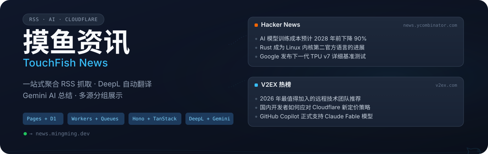
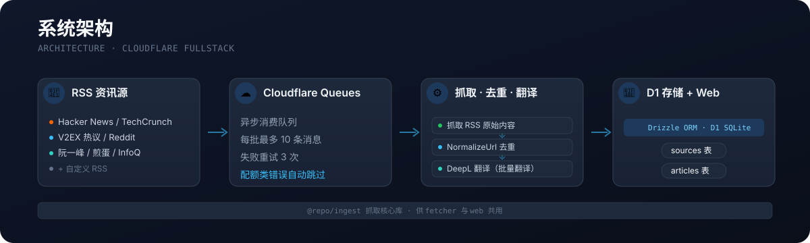

<p align="center">
  
</p>

<p align="center">
  一站式聚合 RSS 抓取、DeepL 翻译与 Gemini AI 总结的中文技术资讯平台。<br>
  定时抓取全球技术资讯源 → 自动翻译英文标题 → 按源分组清晰展示。
</p>

<p align="center">
  
  
  
  
  
  
  
  
  
</p>

<p align="center">
  <a href="#-功能特性">功能特性</a> ·
  <a href="#-技术栈">技术栈</a> ·
  <a href="#-快速开始">快速开始</a> ·
  <a href="#-项目结构">项目结构</a>
</p>


## 🎯 功能特性

<table>
  <tr>
    <td width="50%" align="center">
      <b>🌐 多源聚合</b><br>
      <span>按源分组展示，首页按优先级排序，支持懒加载过期源</span>
    </td>
    <td width="50%" align="center">
      <b>🌍 英文标题翻译</b><br>
      <span>DeepL API 自动翻译拉丁文标题为中文，失败回退原题</span>
    </td>
  </tr>
  <tr>
    <td width="50%" align="center">
      <b>🤖 文章 AI 总结</b><br>
      <span>一键生成 50~80 字中文概述（Gemini flash-lite），结果缓存 D1</span>
    </td>
    <td width="50%" align="center">
      <b>🔥 V2EX 热议适配</b><br>
      <span>Firecrawl 抓取首页热榜 + 逐条补全正文，覆盖无 RSS 源</span>
    </td>
  </tr>
  <tr>
    <td width="50%" align="center">
      <b>⚡ 异步抓取</b><br>
      <span>Cloudflare Queues 异步消费，规避 Pages 同步阻塞</span>
    </td>
    <td width="50%" align="center">
      <b>🔐 隐蔽管理后台</b><br>
      <span>标题连点 3 次进入 /fish，GitHub 登录保护，仅管理员可访问</span>
    </td>
  </tr>
  <tr>
    <td width="50%" align="center">
      <b>👤 用户登录与已读</b><br>
      <span>GitHub OAuth 登录（better-auth），已读状态持久化 D1</span>
    </td>
    <td width="50%" align="center">
      <b>⬇️ 离线仍可用</b><br>
      <span>未登录用户沿用 localStorage 已读，匿名体验不变</span>
    </td>
  </tr>
</table>


## 🏗️ 架构概览

两个部署单元 + 一个共享库，抓取逻辑只维护一份：

- **web**（Cloudflare Pages）：TanStack Start SSR + Hono API，既是前端也是 API 服务器，同时是 Queue 的 **producer**。
- **fetcher**（Cloudflare Workers）：Cron 触发的抓取 Worker，是 Queue 的 **consumer**，负责抓 RSS → 去重 → DeepL 翻译 → 入库 D1。
- **@repo/ingest**（packages/ingest）：抓取核心库，供 fetcher 与 web 共用。

<p align="center">
  
</p>

## ⚡ 快速开始

### 前置条件

- Node.js ≥ 20 + pnpm 9
- [Wrangler CLI](https://developers.cloudflare.com/workers/wrangler/) 已登录

### 1. 安装

```bash
pnpm install
```

### 2. 创建 D1 数据库

```bash
wrangler d1 create news-aggregator
# 将生成的 database_id 填入 apps/web/wrangler.toml 与 apps/fetcher/wrangler.toml
wrangler d1 migrations apply news-aggregator --local
```

### 3. 创建 Queue

```bash
wrangler queues create news-fetch-queue
```

### 4. 配置 API keys

```bash
# Fetcher
cp apps/fetcher/.dev.vars.example apps/fetcher/.dev.vars
# 填入 DEEPL_API_KEY、FIRECRAWL_API_KEY

# Web — 文章 AI 总结
echo "GEMINI_API_KEY=your_key" >> apps/web/.dev.vars
```

### 5. 启动

```bash
# 终端 1：前端 + API
pnpm dev:web

# 终端 2：抓取 Worker
pnpm dev:fetcher
```

访问 **http://localhost:3000** 查看首页。管理后台入口为 `/fish`（首页标题连点 3 次进入）。

> **本地开发注意**：web 的 `.dev.vars` 设置 `DIRECT_FETCH=true` 时，API 跳过 Queue 直接同步抓取；本地 fetcher 与 web 的 Queue 不互通。


## 📁 项目结构

```
.
├── apps/
│   ├── web/                  # TanStack Start 前端 + Hono API（Cloudflare Pages）
│   │   ├── app/routes/       # 文件路由（index.tsx / fish.tsx / api/$.ts）
│   │   ├── app/server/       # Hono 路由（articles / sources / auth）
│   │   └── app/components/   # React 组件
│   └── fetcher/              # 定时抓取 Worker（仅 src/index.ts，逻辑复用 @repo/ingest）
├── packages/
│   ├── db/                   # Drizzle schema + D1 client（sources / articles 表）
│   ├── ingest/               # 抓取核心库（RSS / 去重 / DeepL / Firecrawl / V2EX）
│   ├── shared/               # 共享类型与工具（normalizeUrl / shouldFetchNow 等）
│   └── telemetry/            # 结构化日志（logger）
├── turbo.json                # build / dev / typecheck / lint / deploy
├── pnpm-workspace.yaml
└── .pnpmfile.cjs             # 锁定 @tanstack/* 到 1.114.1
```

## 📊 数据模型

两张 D1 表（完整定义见 `packages/db/src/schema.ts`）：

| 表 | 主要字段 |
|---|---|
| **sources** | `id` / `name` / `url` / `priority` / `fetch_frequency`（hourly\|twice_daily\|daily）/ `is_active` / `last_fetched_at` |
| **articles** | `id` / `source_id`（FK cascade）/ `title` / `translated_title` / `url`（**唯一约束**）/ `published_at` / `summary`（AI 缓存）/ `metadata`（json） |

关键索引：`articles_source_url_idx`（同源跨 URL 去重）、`articles_source_published_idx`、`sources_priority_idx`


## 📡 API 概览

所有 API 通过 `app/routes/api/$.ts` 挂载到 `/api/*`，入参用 `zValidator` + Zod 校验：

| 方法 | 路径 | 说明 |
|---|---|---|
| GET | `/api/articles/grouped?scope=active\|stale` | 按源聚合文章，`active` 只返活跃源，带 `X-Has-Stale` 响应头 |
| GET | `/api/articles/:id/summary` | AI 总结（四级回退：D1 缓存 → 真爬虫 UA 抓页 → AMP 变体 → RSS 简介 → Browser Rendering） |
| POST | `/api/sources/:id/fetch` | 触发单源抓取 |
| POST | `/api/sources/fetch-all` | 触发全量抓取 |
| POST | `/api/sources/detect` | 输入网址自动探测 RSS |
| `*` | `/api/sources/*` | 资讯源 CRUD / 批量启停 / 批量删除 |
| GET | `/api/read/articles` | 获取当前用户已读文章 ID 列表 |
| POST | `/api/read/articles` | 单条标记已读 |
| POST | `/api/read/articles/batch` | 批量标记已读 |
| `*` | `/api/auth/*` | better-auth：GitHub OAuth 登录 / 登出 / 会话 |


## 🧪 代码质量

提交前 husky 自动执行质量门禁（不可 `--no-verify` 跳过）：

```bash
pnpm lint        # Biome 检查（格式化 + import 整理 + lint）
pnpm typecheck   # 全 workspace tsc --noEmit
pnpm test        # Vitest 单测（node 池，纯逻辑）
```

其他常用命令：

```bash
pnpm lint:fix    # Biome 自动修复 + 格式化
pnpm test:watch  # 单测 watch 模式
pnpm test:e2e    # 端到端测试（真 workerd + 真 D1，手动运行）
pnpm build       # 构建全 workspace
pnpm cleanup     # 清理悬挂的 workerd / esbuild 进程
pnpm db:generate # 生成 Drizzle 迁移
```


## 🚀 部署

### 资源准备

1. 在 Cloudflare 控制台创建 D1 数据库 `news-aggregator`，复制 `database_id` 到两个 `wrangler.toml`
2. 创建 Queue `news-fetch-queue`
3. 应用迁移：`wrangler d1 migrations apply news-aggregator --remote`
4. 配置 Secrets（`wrangler secret put <NAME>`）：

| Secret | 位置 | 用途 |
|---|---|---|
| `DEEPL_API_KEY` | fetcher | DeepL 翻译 |
| `FIRECRAWL_API_KEY` | fetcher | V2EX 反爬抓取 |
| `GEMINI_API_KEY` | web | AI 文章总结 |
| `GITHUB_CLIENT_ID` / `GITHUB_CLIENT_SECRET` | web | GitHub OAuth 登录 |
| `BETTER_AUTH_SECRET` | web | 会话签名（不设则部署后登录态丢失） |

> **GitHub OAuth 注意事项**：一个 OAuth App 只能配一个 callback URL。推荐建两个 App（生产 + 本地），或本地开发时临时更换凭据。

### 部署命令

```bash
pnpm deploy:fetcher      # 部署抓取 Worker
pnpm deploy:web          # 部署前端 + API
```

better-auth 表在首次请求时自动建表。首次部署后可手动触发一次迁移（避免被 `/api/auth/*` 通配拦截）：

```bash
curl -X POST https://<your-domain>/api/admin-migrate
```


## ⚠️ 已知坑

- **本地 D1 分离**：web 与 fetcher 各自有独立 sqlite 文件，新增迁移后两个本地库都要应用迁移
- **TanStack 版本锁定**：`.pnpmfile.cjs` 硬锁 `@tanstack/*` 到 `1.114.1`，升级需同步改此文件
- **静态资源目录唯一**：favicon / logo / `_headers` 只放在 `apps/web/public/`，根目录 `public/` 已删除
- **正文抽取改动要实测**：文章总结的 live 抓取依赖 `@mozilla/readability`，改动 `packages/shared/src/extract.ts` 后务必用真实文章页测试
- **本地 fetcher 不收 web 的消息**：本地开发时两个进程 Queue 不互通，web 需设 `DIRECT_FETCH=true` 才能同步抓取
